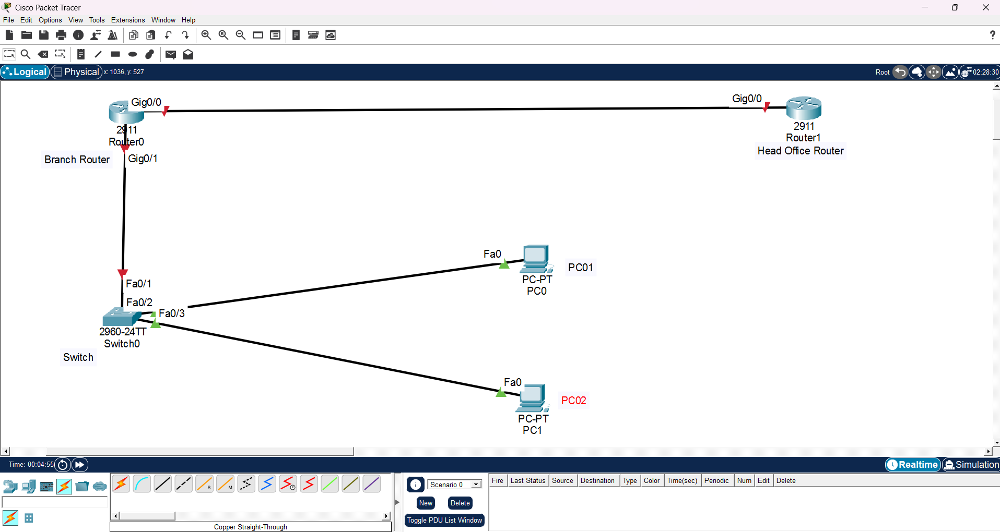

# enterprise-routing-and-switching-lab
A simulated enterprise network demonstrating OSPF and BGP dynamic routing, VLAN segmentation, VRF-style routing isolation, and a VXLAN overlay. Built across two environments — Cisco Packet Tracer for the routing/switching core, and Linux network namespaces for the two features Packet Tracer couldn't support. This project is Project 1 of a Network Security Engineer portfolio track.

## Objective

Simulate a small enterprise network with a Head Office and a Branch Office, connected via a routed WAN link, with local network segmentation at the branch using VLANs — then extend it with the routing/segmentation concepts most fresher portfolios skip: BGP peering with an external AS, VRF-style multi-tenant isolation, and a VXLAN overlay with live packet-capture proof of encapsulation. The goal throughout was to demonstrate hands-on configuration, verification, and honest troubleshooting — not just clean success screenshots.

## A Note on Tooling
 
The core lab (topology, OSPF, VLANs, BGP) is built in Cisco Packet Tracer. VRF-Lite and VXLAN are not supported in this Packet Tracer build (confirmed by testing — see Troubleshooting Log), and no Cisco IOSv image was available for GNS3. Rather than skip these concepts, they're demonstrated using Linux's native equivalents on a Kali VM: network namespaces for VRF-style isolation, and the kernel's built-in VXLAN interface type for the overlay. This is a legitimate way these concepts are implemented in real cloud/SDN environments, and arguably shows a deeper understanding than a GUI-driven Cisco config would.

## Topology

- **Head Office Router** (Cisco 2911) — simulates the head office edge router
- **Branch Router** (Cisco 2911) — simulates the branch office router, handles inter-VLAN routing
- **Switch0** (Cisco 2960-24TT) — Layer 2 access switch at the branch, hosts two VLANs
- **PC0, PC1** — end devices, placed in separate VLANs to demonstrate segmentation

## IP Addressing Plan (VLSM)
 
| Network | Purpose | CIDR |
|---|---|---|
| 192.168.1.0/30 | Branch Router ↔ Head Office Router (WAN link) | /30 |
| 192.168.10.0/24 | VLAN 10 — Staff | /24 |
| 192.168.20.0/24 | VLAN 20 — Guest | /24 |
| 192.168.2.0/30 | Branch Router ↔ ISP Router (BGP link) | /30 |
| 203.0.113.0/24 | ISP Router loopback (simulated external network) | /24 |
 
| Device | Interface | IP Address |
|---|---|---|
| Branch Router | GigabitEthernet0/0 | 192.168.1.1 |
| Branch Router | GigabitEthernet0/1.10 (VLAN 10) | 192.168.10.1 |
| Branch Router | GigabitEthernet0/1.20 (VLAN 20) | 192.168.20.1 |
| Branch Router | GigabitEthernet0/2 (to ISP) | 192.168.2.1 |
| Head Office Router | GigabitEthernet0/0 | 192.168.1.2 |
| ISP Router | GigabitEthernet0/0 | 192.168.2.2 |
| ISP Router | Loopback0 | 203.0.113.1 |
| PC0 | FastEthernet0 (VLAN 10) | 192.168.10.10 |
| PC1 | FastEthernet0 (VLAN 20) | 192.168.20.10 |
 
**Advanced phase (Linux, separate address space):**
 
| Network | Purpose |
|---|---|
| 10.10.10.0/24 | Reused identically inside both `customer-a` and `customer-b` namespaces — proves routing-table isolation |
| 172.16.0.0/30 | Underlay link between `site-a` and `site-b` namespaces |
| 192.168.100.0/24 | VXLAN overlay network (VNI 100) between `site-a` and `site-b` |
 
## What Was Implemented
 
### 1. Physical Topology & Cabling
Connected Head Office Router, Branch Router, Switch0, and two end devices. Verified all links reached an "up/up" state before proceeding.
 
### 2. IP Addressing
Configured static IP addressing on all router interfaces and end devices per the VLSM plan above, and verified reachability with `show ip interface brief` and point-to-point pings.
 
### 3. OSPF Dynamic Routing
Configured single-area OSPF (Area 0) between the Branch Router and Head Office Router. Verified neighbor adjacency reached `FULL` state and confirmed the Head Office Router learned the branch's VLAN subnet via OSPF (`show ip route ospf`).
 
### 4. VLAN Segmentation & Inter-VLAN Routing
Created two VLANs on Switch0 (VLAN 10 – Staff, VLAN 20 – Guest), assigned access ports, configured a trunk link to the Branch Router, and implemented **router-on-a-stick** using sub-interfaces (`Gi0/1.10`, `Gi0/1.20`) for inter-VLAN routing. Verified VLAN isolation at Layer 2 and successful routed communication between VLANs at Layer 3 (confirmed via TTL decrement on ping, proving the traffic crossed a router hop).
 
### 5. BGP Peering (Advanced Phase)
Added a third router (ISP Router, Cisco 2911) connected to the Branch Router on a new link, simulating an external network. Configured eBGP between the Branch Router (AS 65001) and the ISP Router (AS 65002), with the Branch Router advertising its two VLAN subnets and the ISP Router advertising a loopback network. Verified the neighbor session reached an established state, confirmed both routers' BGP tables contained the learned routes with correct AS-path attributes, and confirmed end-to-end reachability with a 100% successful ping across the BGP-learned route.
 
### 6. VRF-Style Routing Isolation (Advanced Phase, Linux)
Since Packet Tracer's router models didn't support VRF-Lite configuration, this was demonstrated using Linux network namespaces on the Kali VM. Two namespaces (`customer-a`, `customer-b`) were each given an interface with the **identical** IP address (10.10.10.1/24) — something that would conflict in a single routing table, but coexists cleanly because each namespace maintains a fully independent routing table, the same isolation model VRF provides on a router.
 
### 7. VXLAN Overlay (Advanced Phase, Linux)
Two more namespaces (`site-a`, `site-b`) simulated two physical sites, connected only by a basic Layer 3 underlay link (172.16.0.0/30). A VXLAN interface (VNI 100, UDP port 4789) was built on top of that underlay in each namespace, creating an overlay network (192.168.100.0/24) that behaves as if directly connected. Overlay connectivity was confirmed with a successful ping, and the encapsulation itself was proven by capturing underlay traffic with `tcpdump` during the overlay ping — showing each ICMP packet wrapped inside a UDP/4789 VXLAN packet between the underlay IPs, tagged with VNI 100.
 
## Troubleshooting Log
 
Documenting issues encountered and resolved is arguably the most useful part of this project — it reflects real diagnostic work, not just following steps.
 
| Issue | Root Cause | Resolution |
|---|---|---|
| Link between Switch0 and PC1 showed down (dashed line) | Wrong cable type used (Copper Cross-Over instead of Straight-Through) for a switch-to-PC connection | Replaced with Copper Straight-Through cable; link came up immediately |
| `interface gigabitEthernet0/0/0` command rejected on router | Assumed interface naming from a different router model (ISR 8200 series); actual router used was a Cisco 2911, which uses `Gi0/0` / `Gi0/1` naming | Verified actual interface names via the router's physical view before issuing config commands |
| Sub-interface `fastEthernet0/1.10` rejected with "Invalid interface type and number" | Assumed the router used a FastEthernet interface toward the switch, based on the switch-side port label; the router-side interface was actually GigabitEthernet0/1 | Re-verified interface type directly on the router (not the switch) and reconfigured sub-interfaces as `gigabitEthernet0/1.10` / `.20` |
| BGP neighbor showed as established (non-zero PfxRcd), but `show ip bgp` was empty on both routers and end-to-end ping failed at 0% success | Packet Tracer's BGP simulation engine established the session but did not automatically trigger a full route exchange | Issued `clear ip bgp *` on both routers to force a soft reset; routes then populated correctly and the ping succeeded at 100% |
| `ip vrf CUSTOMER-A` and `vrf definition CUSTOMER-A` both rejected with "Invalid input" on a Cisco ISR 4321 in Packet Tracer | This Packet Tracer build's ISR 4321 image does not include VRF-Lite support, despite it being a supported feature on real ISR 4321 hardware | Pivoted VRF demonstration to Linux network namespaces on the Kali VM instead of continuing to fight tooling limitations |
| VXLAN veth interfaces inside the namespaces showed "linkdown" in `ip route` output, though a same-namespace ping still succeeded | The host-side end of each veth pair (`veth-a-br`, `veth-b-br`) was never brought up; the successful ping was resolving through the loopback interface, masking the actual link state | Brought up both host-side veth ends with `ip link set ... up`, confirmed "linkdown" cleared in the route output |
 
## Verification Evidence
 
Screenshots for each phase are in the [/screenshot](/screenshot) folder:

**[/screenshots/phase1_topology/](/screenshots/phase1_topology/).**
- [/screenshots/phase1_topology/01_packet_tracer_interface.png](/screenshots/phase1_topology/01_packet_tracer_interface.png) — initial Packet Tracer environment
- [/screenshots/phase1_topology/02_topology_diagram.png](/screenshots/phase1_topology/02_topology_diagram.png) — full topology with all links up

**[/screenshots/phase2_ip_addressing/](/screeenshots/phase2_ip_addressing/)**
- [/screenshots/phase2_ip_addressing/03_branch_router_config.png](/screenshots/phase2_ip_addressing/03_branch_router_config.png) — Branch Router interface IP config (CLI)
- [/screenshots/phase2_ip_addressing/04_head_office_router_conf.png](/screenshots/phase2_ip_addressing/04_head_office_router_conf.png) — Head Office Router interface IP config (CLI)
- [/screenshots/phase2_ip_addressing/05_pc0_conf.png](/screenshots/phase2_ip_addressing/05_pc0_conf.png) — PC0 static IP configuration
- [/screenshots/phase2_ip_addressing/06_ip_configuration_topology.png](/screenshots/phase2_ip_addressing/06_ip_configuration_topology.png) — topology annotated with all assigned IPs
- [/screenshots/phase2_ip_addressing/07_ip_interface_on_branch_router.png](/screenshots/phase2_ip_addressing/07_ip_interface_on_branch_router.png) — interface verification + successful WAN ping

**[/screenshots/phase3_ospf/](/screeenshots/phase3_ospf)**
- [/screenshots/phase3_ospf/08_ospf_config_on_branch_router.png](/screenshots/phase3_ospf/08_ospf_config_on_branch_router.png) — OSPF process config on Branch Router
- [/screenshots/phase3_ospf/09_ospf_config_on_head_office_router.png](/screenshots/phase3_ospf/09_ospf_config_on_head_office_router.png) — OSPF process config on Head Office Router
- [/screenshots/phase3_ospf/10_neighbor_state_on_branch_router.png](/screenshots/phase3_ospf/10_neighbor_state_on_branch_router.png) — neighbor adjacency reaching FULL state
- [/screenshots/phase3_ospf/11_ip_route_ospf_on_head_office_router.png](/screenshots/phase3_ospf/11_ip_route_ospf_on_head_office_router.png) — Head Office Router learning the branch's VLAN subnet via OSPF

**[/screenshots/phase4_vlan/](/screenshots/phase4_vlan)**
- [/screenshots/phase4_vlan/12_vlan_conf_on_switch.png](/screenshots/phase4_vlan/12_vlan_conf_on_switch.png) — VLAN creation, access ports, trunk config on Switch0
- [/screenshots/phase4_vlan/13_sub_interface_naming_error_on_branch_router](/screenshots/13_sub_interface_naming_error_on_branch_router.png) — the sub-interface naming error encountered (see Troubleshooting Log)
- [/screenshots/phase4_vlan/13_sub_interface_config_on_branch_router.png](/screenshots/phase4_vlan/13_sub_interface_config_on_branch_router.png) — corrected sub-interface config, verified up/up
- [/screenshots/phase4_vlan/14_pc1_in_vlan20_conf.png](/screenshots/phase4_vlan/14_pc1_in_vlan20_conf.png) — PC1 re-addressed into VLAN 20
- [/screenshots/phase4_vlan/15_pc0_to_pc1_ping.png]([/screenshots/phase4_vlan/15_pc0_to_pc1_ping.png) — successful inter-VLAN ping (TTL=127 confirms routed hop)

**[/sreenshots/phase5-bgp](/screenshots/phase5_bgp)**
- [/sreenshots/phase5-bgp/16_topology_with_isp_router.png](/screenshots/phase5_bgp/16_topology_with_isp_router.png) — topology extended with the ISP Router and new link
- [/sreenshots/phase5-bgp/17_isp_router_loopbakc_config.png](/screenshots/phase5_bgp/17_isp_router_loopbakc_config.png) — loopback interface config (simulated external network)
- [/sreenshots/phase5-bgp/18_bgp_config_on_branch_router.png](/screenshots/phase5_bgp/18_bgp_config_on_branch_router.png) — BGP process config, AS 65001
- [/sreenshots/phase5-bgp/19_bgp_config_on_isp_router.png](/screenshots/phase5_bgp/19_bgp_config_on_isp_router.png) — BGP process config, AS 65002
- [/sreenshots/phase5-bgp/20_neighbor_state_established_on_branch_router.png](/screenshots/phase5_bgp/20_neighbor_state_established_on_branch_router.png) — populated BGP table + 100% successful ping, post-fix
- [/sreenshots/phase5-bgp/21_neighbor_state_established_on_isp_router.png](/screenshots/phase5_bgp/21_neighbor_state_established_on_isp_router.png) — populated BGP table on the ISP side, post-fix

**[/screenshots/phase6_vrf/](/screenshots/phase6_vrf)** (Linux network namespaces)
- [/screenshots/phase6_vrf/22_ip_netlist_and_ip_route.png](/screenshots/phase6_vrf/22_ip_netlist_and_ip_route.png) — both namespaces created, identical-IP routes shown (with the initial "linkdown" state)
- [/screenshots/phase6_vrf/23_linkdown_error_fix.png](/screenshots/phase6_vrf/23_linkdown_error_fix.png) — link-state fix applied, clean final routing tables

**[/screenshots/phase7_vxlan](/screenshots/phase7_vxlan/)** (Linux network namespaces)
- [/screenshots/phase7_vxlan/24_creating_underlay_link.png](/screenshots/phase7_vxlan/24_creating_underlay_link.png) — underlay link setup between site-a and site-b
- [/screenshots/phase7_vxlan/25_underlay_connectivity_confirm.png](/screenshots/phase7_vxlan/25_underlay_connectivity_confirm.png) — underlay reachability confirmed
- [/screenshots/phase7_vxlan/26_creating_vxlan_interface.png](/screenshots/phase7_vxlan/26_creating_vxlan_interface.png) — VXLAN interfaces created (VNI 100) in both namespaces
- [/screenshots/phase7_vxlan/27_namespace_verification.png](/screenshots/phase7_vxlan/27_namespace_verification.png) — confirming VNI, local/remote IPs, UP state
- [/screenshots/phase7_vxlan/28_vxlan_interface_verification.png](/screenshots/phase7_vxlan/28_vxlan_interface_verification.png) — successful ping across the overlay network
- [/screenshots/phase7_vxlan/29_tcpdump_vxlan_encapsulation_proof.png](/screenshots/phase7_vxlan/29_tcpdump_vxlan_encapsulation_proof.png) — live packet capture showing UDP/4789 VXLAN encapsulation of the overlay ICMP traffic

## Configs

Full running-config command sequences for each device are in [/configs](/configs).
- [/configs/branch_router_config.txt](/configs/branch_router_config.txt) — base config (WAN, VLAN sub-interfaces, OSPF)
- [/configs/branch_router_bgp_addition.txt](/configs/branch_router_bgp_addition.txt) — BGP addition (append after the base config)
- [/configs/head_office_router_config.txt](/configs/head_office_router_config.txt)
- [/configs/switch0_config.txt](/configs/switch0_config.txt)
- [/configs/isp_router_config.txt](/configs/isp_router_config.txt) — ISP Router (BGP peer)
- [/configs/vrf_and_vxlan_linux_commands.sh](/configs/vrf_and_vxlan_linux_commands.sh) — full Linux command sequence for the VRF-equivalent and VXLAN phases (Kali VM

## Tools Used
 
- Cisco Packet Tracer
- Linux network namespaces (Kali VM) — for VRF-style isolation and the VXLAN overlay
  
## Skills Demonstrated
 
`Routing & Switching` `OSPF` `BGP` `VLAN Segmentation` `Router-on-a-Stick` `VRF Concepts` `VXLAN` `VLSM Subnetting` `Network Troubleshooting` `Cisco IOS CLI` `Linux Networking`

---
*Part of a Network Security Engineer portfolio. See also: [VAPT Analyst portfolio projects] for offensive security work.*
